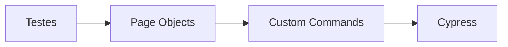
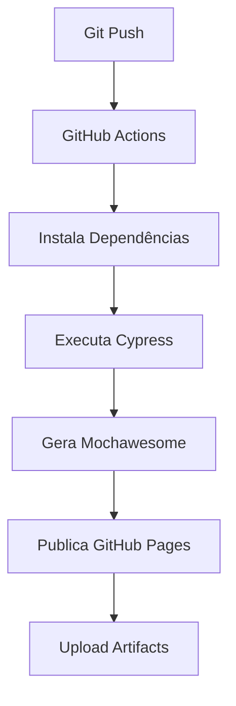

# 🚀 Automação Web com Cypress

Projeto desenvolvido para demonstrar boas práticas de automação de testes Web utilizando **Cypress**, seguindo uma arquitetura baseada em **Page Objects**, **Custom Commands**, integração contínua com **GitHub Actions**, geração de relatórios com **Mochawesome** e publicação automática no **GitHub Pages**.

---

[](https://github.com/Bruno-Dotto/Automacao-Web-Cypress/actions/workflows/cypress.yml)
[](https://bruno-dotto.github.io/Automacao-Web-Cypress/)


[](LICENSE)

---

# 📑 Índice

- [Objetivo](#-objetivo)
- [Tecnologias](#-tecnologias-utilizadas)
- [Arquitetura](#-arquitetura)
- [Estrutura do Projeto](#-estrutura-do-projeto)
- [Pipeline CI/CD](#-pipeline-cicd)
- [Instalação](#-instalação)
- [Scripts Disponíveis](#-scripts-disponíveis)
- [Relatórios](#-relatórios)
- [Casos Automatizados](#-casos-automatizados)
- [Boas Práticas](#-boas-práticas-utilizadas)
- [Roadmap](#-roadmap)
- [Autor](#-autor)

---

# 🎯 Objetivo

Este projeto foi desenvolvido para consolidar conhecimentos em:

- Automação Web
- Cypress
- JavaScript
- Page Objects
- Custom Commands
- FakerJS
- Smoke Tests
- GitHub Actions
- CI/CD
- Mochawesome
- GitHub Pages

---

# 🛠 Tecnologias Utilizadas

| Tecnologia | Finalidade |
|------------|------------|
| Cypress | Automação Web |
| JavaScript | Linguagem |
| FakerJS | Massa de dados |
| GitHub Actions | CI/CD |
| Mochawesome | Relatórios |
| GitHub Pages | Publicação do relatório |
| Node.js | Ambiente de execução |

---

# 🏗 Arquitetura

O projeto utiliza o padrão **Page Objects**, separando responsabilidades entre testes, páginas e comandos personalizados.



---

# 📁 Estrutura do Projeto

```
Automacao-Web-Cypress
│
├── .github
│   └── workflows
│       └── cypress.yml
│
├── cypress
│   ├── e2e
│   │
│   ├── fixtures
│   │
│   ├── reports
│   │
│   ├── screenshots
│   │
│   ├── videos
│   │
│   └── support
│       ├── commands
│       ├── pages
│       ├── checkout_commands.js
│       ├── login_commands.js
│       └── commands.js
│
├── cypress.config.js
├── package.json
└── README.md
```

---

# 🚀 Pipeline CI/CD



A pipeline executa automaticamente:

- Instalação das dependências
- Execução dos testes
- Geração do Mochawesome
- Publicação do relatório
- Upload de Artifacts

---

# ⚙ Instalação

Clone o projeto

```bash
git clone https://github.com/Bruno-Dotto/Automacao-Web-Cypress.git
```

Entre na pasta

```bash
cd Automacao-Web-Cypress
```

Instale as dependências

```bash
npm install
```

---

# 📦 Dependências utilizadas

## Cypress

```bash
npm install cypress --save-dev
```

## FakerJS

```bash
npm install @faker-js/faker
```

## Cypress Grep

```bash
npm install @cypress/grep --save-dev
```

## Mochawesome

```bash
npm install mochawesome mochawesome-merge mochawesome-report-generator --save-dev
```

---

# ▶ Scripts Disponíveis

## Abrir o Cypress

```bash
npm run cy:open
```

## Executar todos os testes

```bash
npm run cy:run
```

## Executar Smoke

```bash
npm run smoke
```

## Executar Regressão

```bash
npm run regression
```

## Limpar relatórios

```bash
npm run clean-report
```

## Gerar Merge

```bash
npm run merge-report
```

## Gerar HTML

```bash
npm run generate-report
```

## Gerar relatório completo

```bash
npm run report
```

## Smoke + Relatório

```bash
npm run smoke-report
```

---

# 📊 Relatórios

Após cada execução são gerados:

- ✅ JSON
- ✅ HTML
- ✅ Screenshots em caso de falha
- ✅ Vídeos em caso de falha

### Relatório Online

👉 https://bruno-dotto.github.io/Automacao-Web-Cypress/

---

# ✅ Casos Automatizados

## Login

- Login com sucesso
- E-mail inválido
- Senha inválida
- E-mail em branco
- Senha em branco
- Navegação para cadastro

---

## Cadastro

- Cadastro com sucesso
- Usuário em branco
- E-mail em branco
- Senha em branco

---

## Checkout

- Preenchimento dos dados
- Seleção do país
- Seleção da cidade
- Métodos de pagamento
- Validação dos métodos
- Finalização do pedido

---

# 💡 Boas Práticas Utilizadas

- ✔ Page Objects
- ✔ Custom Commands
- ✔ Reutilização de código
- ✔ Geração dinâmica de massa de dados
- ✔ Estrutura escalável
- ✔ Smoke Tests
- ✔ GitHub Actions
- ✔ GitHub Pages
- ✔ Mochawesome
- ✔ CI/CD

---

# 📌 Roadmap

- [x] Login
- [x] Cadastro
- [x] Checkout
- [x] Page Objects
- [x] Custom Commands
- [x] GitHub Actions
- [x] Mochawesome
- [x] GitHub Pages
- [ ] Dashboard de Métricas
- [ ] Integração com Playwright
- [ ] Integração com Maestro

---

# 👨‍💻 Autor

**Bruno Dotto**

GitHub

https://github.com/Bruno-Dotto

LinkedIn

(Adicionar)

---

⭐ Caso este projeto tenha sido útil, deixe uma estrela no repositório.